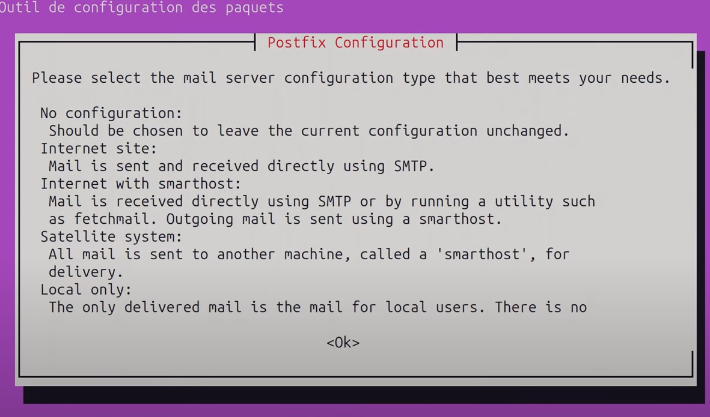
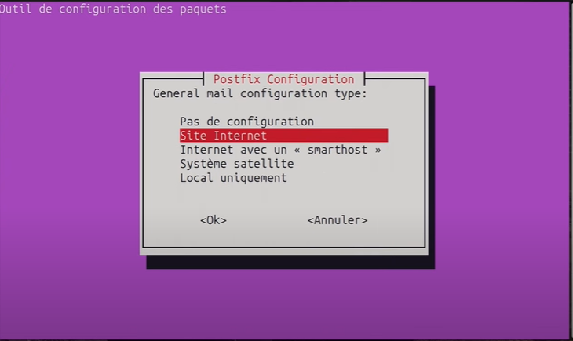
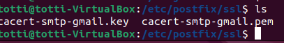
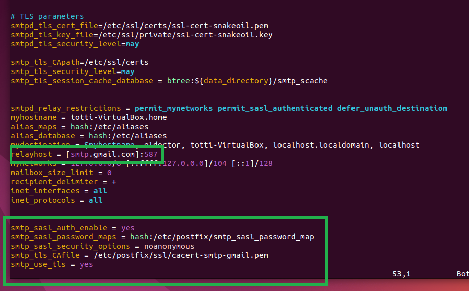
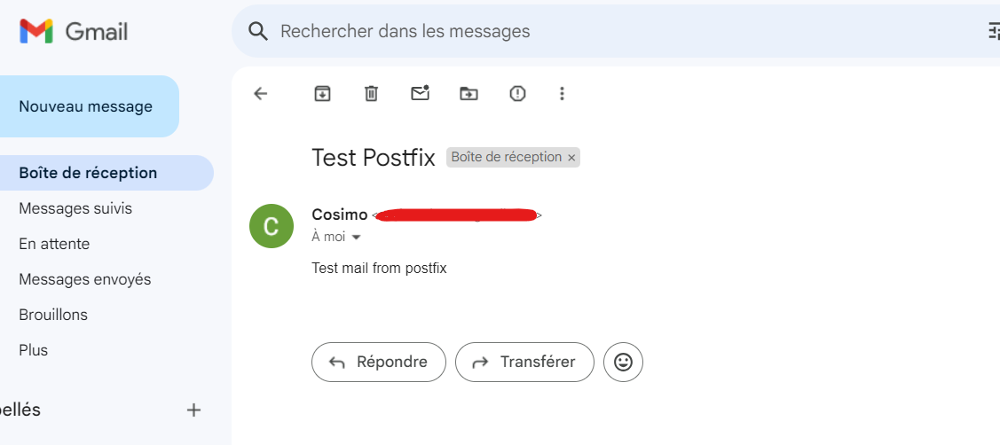
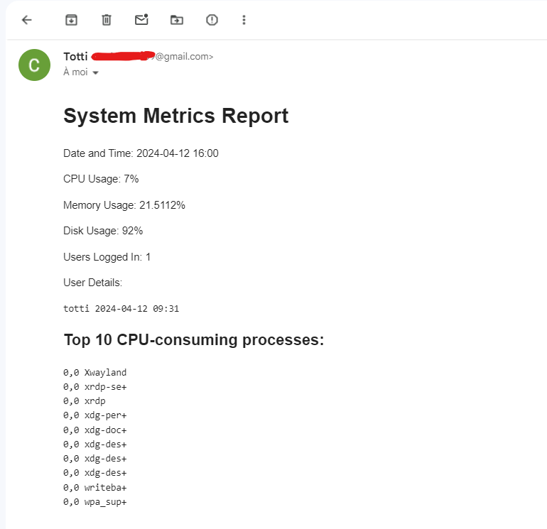

# How to configure free gmail SMTP on Linux and send your emails with Postfix

> Prerequisites: 
> - A gmail address with dual authentication enabled 
> - Linux distribution (F.E on Virtual Machine)
>
>
> ## In Gmail
>
> Connect to your google account and go to your gmail. After that just follow the next images to configure your password app.  
>
> - /!\ Keep well the password created somewhere else, you will need it to configure a file in your Linux system.
> - /!\ If you don't find by the way that I'm showing you just go in your "Google account settings" and on the research bar type: _app password_ and you will find it straight away. (Check the last picture)
>
#### Steps on gmail

- Other way to access:

## Now that is done we can pass on the configuration in Linux.

In this case I'm using:

- Ubuntu Desktop 22.04 on Virtual box
- 4096 Mo of RAM
- 3 CPU cores
- 25 GB of storage
- Adaptater 1 : NAT
- Ubuntu 22.04 
- Hostname: `Linux-desktop`
- Software that we will use : Postfix

#### What is Postfix?

Postfix is a mail transfer agent (MTA), which is essentially software that handles the delivery of emails between servers. In simpler terms, it's like a post office for emails. When you send an email, your email client (like Gmail or Outlook) communicates with the Postfix server, which then takes care of routing the email to the recipient's email server.

- **To keep in mind**: 
Port 587 is commonly used for email submission. Unlike port 25, which is traditionally used for SMTP (Simple Mail Transfer Protocol) communication between mail servers, port 587 is specifically designated for email clients (such as Outlook, Thunderbird, or Apple Mail) to submit outgoing emails to a mail server.

#### **1st step**: Opening port 587 with UFW

- Check if the port 587 is open in our firewall
- If it's a new virtual machine by default there is no firewall installed so we will use the simplest one which is ufw.
- After turning on ufw you can add the rule for the port in it using this command:

      sudo ufw allow 587/tcp

- Quick update of the full system.

      sudo apt-get update && sudo apt-get upgrade

  
#### **2nd step**: Installation & configuration of Postfix & Creation of SSL certificate

      sudo apt-get install postfix mailutils libsasl2-2 ca-certificates libsasl2-modules

- While installing you will have this page popping up.

- Just press ok and after press on internet website

- For the system mail name I have put : ubuntu linux
- Press ok and it will finish the installation.

- Activating the Postfix service

      sudo systemctl enable postfix

- Creation of SSL certificate

- **1st**: Create a directory in the following path: /etc/postfix/ssl/

      sudo mkdir /etc/postfix/ssl/

- And go inside the path:

      cd /etc/postfix/ssl/

- Creation of the certificate

      sudo openssl req -newkey rsa:2048 -new -nodes -x509 -days 365 -keyout cacert-smtp-gmail.key -out cacert-smtp-gmail.pem

- This command is used to use the openssl library to generate a private key and associate a certificate with this key, and we're going to make it last 365 days (1 year).
- After launching it the system will ask you some information here are mine:
- Country Name: BE
- State or province name : Brussels
- Locality name: Brussels
- Organization name: Ubuntu
- Organizational Unit Name: Linux
- Common name: Georges
- Email address: ""

- By doing an ls you can notice that the 2 certificates are created

- **2nd**: Configuration of postfix

      sudo vim /etc/postfix/main.cf

- I added this configuration & replaced the relayhost highlighted in the picture
- As you can see the relayhost will pass by the port 587 using smtp gmail.

      relayhost = [smtp.gmail.com]:587
      smtp_sasl_auth_enable = yes
      smtp_sasl_password_maps = hash:/etc/postfix/smtp_sasl_password_map
      smtp_sasl_security_options = noanonymous
      smtp_tls_CAfile = /etc/postfix/ssl/cacert-smtp-gmail.pem
      smtp_use_tls = yes

- Explanation:
-  smtp_sasl_auth_enable = yes: We activate the authentification by SASL
- smtp_sasl_password_maps = hash:/etc/postfix/smtp_sasl_password_map: This is the path of the password where it will take the information to log in
- smtp_sasl_security_options = noanonymous: It doesn't allow anonymous people to connect in.
- smtp_tls_CAfile = /etc/postfix/ssl/cacert-smtp-gmail.pem: Our certificate that we have created
- smtp_use_tls = yes: To allow using tls.

- **3rd**: Password mapping
- We will create the file to retrieve and link the password linked to the smtp_sasl_password_maps.

      sudo vim /etc/postfix/smtp_sasl_password_map

- You add your credentials from your gmail account

      [smtp.gmail.com]:587 USERNAME@gmail.com:PASSWORD
  
- Security: We remove the right of the file on Write and opening for any users.

      sudo chmod 400 /etc/postfix/smtp_sasl_password_map
  
- With this command we generate a DB linked to postfix to manage SMTP connection

      sudo postmap /etc/postfix/smtp_sasl_password_map

- After all those configurations we restart the Postfix service

      sudo systemctl restart postfix 

#### Last step: How to test our configuration

- By doing this command you can check if you well receive an e-mail

      echo "Test mail from postfix" | mail -s "Test Postfix" YOUR-EMAIL@gmail.com

- The system it's working so I included a command with HTML part in the main bash script to receive the e-mail.

      send_email() {

      cat system_metrics.html | mail -s "System Metrics Report" -a "Content-Type: text/html" YOUR_MAIL_ADDRESS@DOMAIN.com

      }

      write_to_html() {

      local date_time cpu_usage memory_usage disk_usage users_logged_in top_cpu_processes users_details
      date_time=$(date "+%Y-%m-%d %H:%M")
      cpu_usage=$(get_cpu_usage)
      memory_usage=$(get_memory_usage)
      disk_usage=$(get_disk_usage)
      users_logged_in=$(get_users_logged_in)
      top_cpu_processes=$(get_top_cpu_processes)
      users_details=$(get_users_details)
      echo "<html>
      <head>
      <title>System Metrics Report</title>
      </head>

      <body>
      <h1>System Metrics Report</h1>
      
Date and Time: $date_time

      
CPU Usage: $cpu_usage

      
Memory Usage: $memory_usage

      
Disk Usage: $disk_usage

      
Users Logged In: $users_logged_in

      
User Details:

      <pre>$users_details</pre>
      <h2>Top 10 CPU-consuming processes:</h2>
      <pre>$top_cpu_processes</pre>
      </body>
      </html>" > system_metrics.html
      }

- Launch your script and check if you well received your e-mail.

## Extra : Crontab configuration

- Launch crontab: if it's the 1st time choose vim or nano to editing.

      crontab -e

- Configuration:

      0 9 * * 1 /home/user/Project-ElDoctor/monitoring-tool.sh

## Source:

I found this tutorial via this video (it's in french) and it was very well explained.

(https://www.youtube.com/watch?v=UuEx_JwNI2s&t=1168s)
