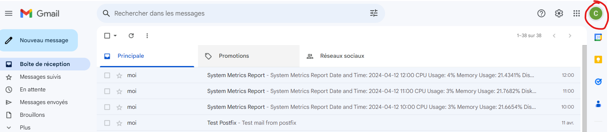
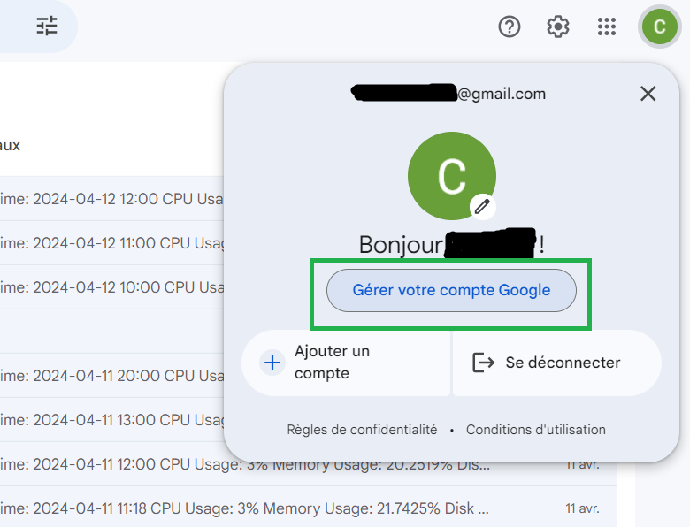
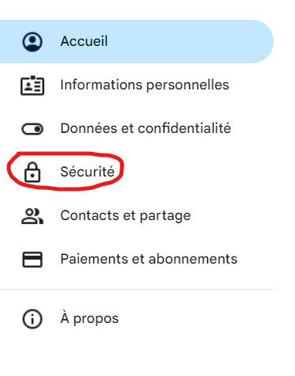
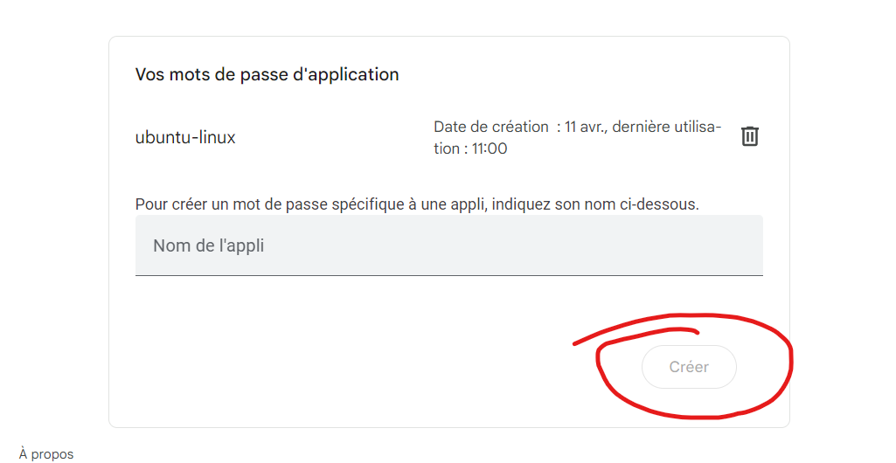
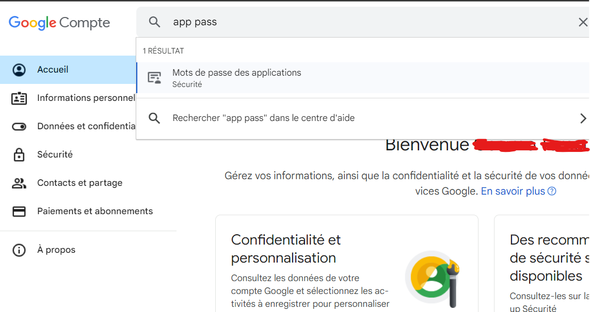

# How to configure free gmail SMTP on Linux and send your emails with Postfix

Prerequisites: 
- A gmail address with dual authentication enabled 
- Linux distribution (F.E on Virtual Machine)

## In Gmail

Connect to your google account and go to your gmail. After that just follow the next images to configure your password app.  

- /!\ Keep well the password created somewhere else, you will need it to configure a file in your Linux system.
- /!\ If you don't find by the way that I'm showing you just go in your "Google account settings" and on the research bar type: _app password_ and you will find it straight away. (Check the last picture)

#### Steps on gmail

- Other way to access:

## Now that is done we can pass on the configuration in Linux.

In this case I'm using:

- Ubuntu Desktop 22.04 on Virtual box
- 4096 Mo of RAM
- 3 CPU cores
- 25 GB of storage
- Adaptater 1 : NAT
- Ubuntu 22.04 
- Hostname: `Linux-desktop`
- Software that we will use : Postfix

#### What is Postfix?

Postfix is a mail transfer agent (MTA), which is essentially software that handles the delivery of emails between servers. In simpler terms, it's like a post office for emails. When you send an email, your email client (like Gmail or Outlook) communicates with the Postfix server, which then takes care of routing the email to the recipient's email server.

- **To keep in mind**: 
Port 587 is commonly used for email submission. Unlike port 25, which is traditionally used for SMTP (Simple Mail Transfer Protocol) communication between mail servers, port 587 is specifically designated for email clients (such as Outlook, Thunderbird, or Apple Mail) to submit outgoing emails to a mail server.

#### **1st step**: Opening port 587 with UFW

- Check if the port 587 is open in our firewall
- If it's a new virtual machine by default there is no firewall installed so we will use the simplest one which is ufw.
- After turning on ufw you can add the rule for the port in it using this command:

      sudo ufw allow 587/tcp

- Quick update of the full system.

      sudo apt-get update && sudo apt-get upgrade

  
#### **2nd step**: Installation & configuration of Postfix & Creation of SSL certificate

## Source:

I found this tip via this video (it's in french) and it was very well explained.

(https://www.youtube.com/watch?v=UuEx_JwNI2s&t=1168s)
